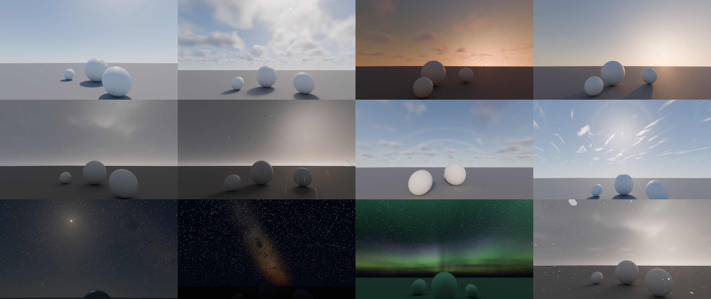
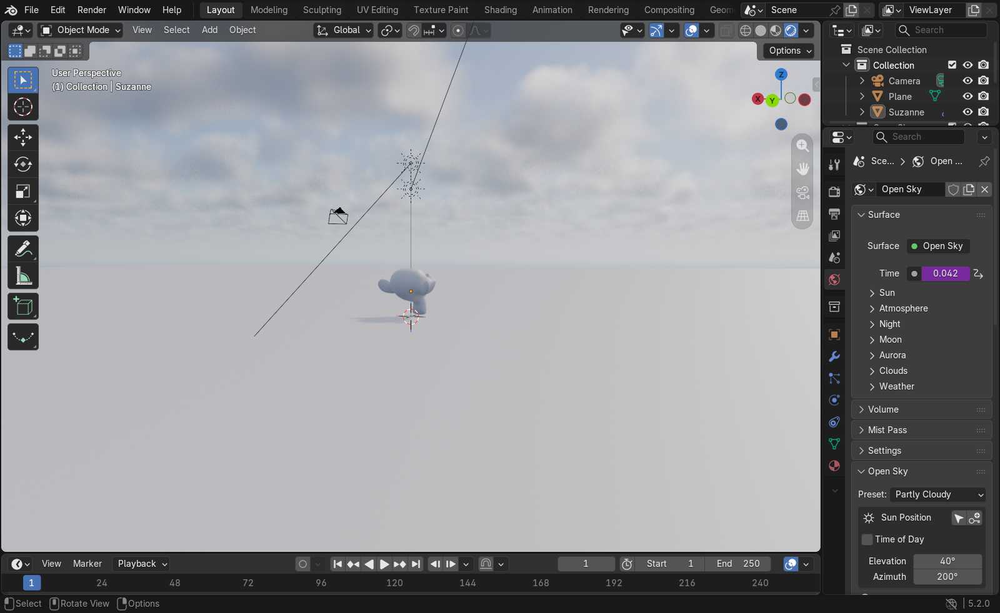

# Open Sky

**A free, open source procedural sky and weather system for Blender.** Day,
sunset, twilight and night in one world shader: a physically inspired
atmosphere, clouds, rain, snow, lightning, rainbows, a sun lamp that always
matches the sky, a moon with real phases, stars, the Milky Way and animated
aurorae.

- Pure Blender nodes, so there are no image textures and no HDRIs.
- Works in **Cycles and EEVEE**, with fast viewport feedback.
- Files keep rendering without the add-on installed.





## Features

- **Day sky**: Rayleigh, Mie and ozone scattering with real optical depths:
  - Blue zenith, a bright horizon and a glow around the sun.
  - The sun reddens and dims as it sets, and the twilight zenith stays blue.
- **Custom air**: set haze density, haze colour and anisotropy, plus horizon fog.
  These cover dust, sand, smoke, smog, fog and humid haze.
- **Sun**:
  - A limb-darkened disc and a glow, seen by the camera only so the sun is
    never counted twice.
  - Strength, colour temperature, tint and angular size.
  - A real Sun lamp is created and kept in sync by drivers: its direction,
    strength and colour all come from the sky.
- **Automatic day to night**:
  - Rotate or animate the sun lamp, or use **Time of Day** (hour, day of year,
    latitude).
  - The sky, the lamps, the stars and (optionally) the camera exposure follow.
- **Moon**:
  - A procedural disc with maria and craters, and phases computed from the
    sun's position.
  - Earthshine and a glow around the moon.
  - It lights the sky, and a dim Moon lamp casts moonlight.
  - **Moon Follows Sun** keeps it opposite the sun; the offset sets the phase.
- **Stars**: procedural, with density, brightness, size, colour variety and
  twinkle.
- **Milky Way**: a band with a warm core and dark dust lanes, placed where it
  really is on the sky.
- **Sky rotation**:
  - Latitude and sky rotation, with a celestial pole overlay for debugging.
  - In Time of Day mode the stars turn with local sidereal time, so the Milky
    Way core rises in the south on summer nights.
- **Aurora**:
  - Animated, layered curtains with vertical rays.
  - Green lower edge fading to violet, with controls for height, thickness,
    scale, waviness, coverage, speed and direction.
- **Clouds**:
  - A cumulus/stratus deck: fluffy fair-weather cumulus, broken cloud,
    overcast and dark storm clouds, set by coverage, density, height,
    thickness, puffiness and darkness.
  - Self-shadowed and lit by the sun, with silver linings, grey bases and
    pink undersides at sunset. At night the moon lights them.
  - High, wispy **cirrus**.
  - Clouds drift with the wind and slowly change shape.
  - They hide the sun, moon and stars, and dim and soften the sun lamp, so an
    overcast sky gives soft, shadowless light.
- **Weather**:
  - **Rain** and **snow** are real geometry: Geometry Nodes drops and flakes
    in a box that follows the camera, blown by the wind. The drops stay fixed
    in the world as the camera moves.
  - Rain and snow also thicken the air.
- **Sky effects**:
  - **Lightning**: random strikes with jagged bolts and flickering flashes
    that light up the clouds.
  - **Rainbow**: primary and secondary bows at the right angles.
  - **22° ice halo** around the sun.
  - Optional **light shafts** (god rays) through a thin world volume.
- **24 presets**:
  - Times of day: Clear Day, Crisp Morning, Golden Hour, Sunset, Blue Hour.
  - Night: Moonlit Night, Starry Night, Aurora Night.
  - Air: Hazy Summer, Foggy Morning, Desert Dust, Wildfire Smoke, City Smog.
  - Clouds and weather: Fair Weather Clouds, Partly Cloudy, Cloudy Sunset,
    Overcast, Rainy Day, Thunderstorm, Snowfall, Blizzard, Cirrus & Halo,
    After the Rain.

## Requirements

Blender 4.5 or newer (tested on 5.2 LTS). Cycles or EEVEE. Windows, macOS or Linux.

## Install

1. Download `open_sky-x.y.z.zip` from the [Releases](../../releases) page.
   Don't unzip it.
2. In Blender, go to *Edit → Preferences → Get Extensions*, open the **⌄**
   menu at the top right, choose **Install from Disk…**, and pick the zip.

## Use

- Open **Sidebar (N) → Sky** or *World Properties → Open Sky* and press
  **Add Open Sky**. This creates:
  - a new world named *Open Sky*;
  - an *Open Sky* collection holding the *OS Sun* and *OS Moon* lamps and the
    *OS Weather* object (rain and snow).
  Your previous world is left untouched.
- Pick a **Preset**, then change the sections: Sun, Atmosphere, Moon,
  Stars & Milky Way, Aurora, Clouds, Weather and Camera & Tools.
- **Rain and Snow** (in Weather) set how hard it falls. *Rain & Snow
  Particles* sets the drop counts, drop size and the size of the box around
  the camera.
- **Light Shafts** adds a world volume for god rays. It renders well in EEVEE
  but is slow in Cycles.
- **Move the sun** with Elevation and Azimuth. You can also select the sun
  lamp and rotate it. To animate it, keyframe its rotation (the key button
  in the panel does this).
- **Time of Day** places the sun from hour, day of year and latitude. Keyframe
  the hour to animate a full day.
  - Near the poles the panel warns about **midnight sun** or **polar night**:
    at 68°N in June the sun never sets, so pick a winter day for a night sky.
- **Night Exposure** raises the camera exposure after sunset, so one animation
  can go from bright day to a starry night.
- Every control also lives on the *Open Sky* group node in the World shader
  editor, where you can keyframe it.

## How it works

```
Texture Coordinate ─► Open Sky (node group) ─► World Output
                         │  OS Atmosphere   sky lit by the sun
                         │  OS Atmosphere   sky lit by the moon
                         │  OS Moon         disc, phase, earthshine, glow
                         │  OS Stars        two Voronoi star layers
                         │  OS Milky Way    band, core and dust lanes
                         │  OS Aurora       10 layered curtain slices
                         │  OS Clouds       8 jittered slices of a cloud deck
                         │  OS Cirrus       one high streaky sheet
                         │  OS Sky FX       rainbow, ice halo, lightning
                         ▼
OS Sun lamp  ──rotation──► "Sun Direction"  ──► lamp strength, colour, size
OS Moon lamp ──rotation──► "Moon Direction" ──► moonlight strength by phase
World inputs ───drivers──► OS Weather (Geometry Nodes rain and snow)
```

- **Atmosphere**: single scattering plus a cheap multiple-scattering term:

  ```
  ext = Rayleigh·air + Ozone·ozone + 0.1·haze·(2 − haze colour)
  T   = exp(−ext · airmass(elevation))
  sky = sun · T_mid · (βR·pR(μ) + βM·pM(μ) + iso) / ext · (1 − T_view)
  ```

  `pR` is the Rayleigh phase function and `pM` the Henyey-Greenstein
  function. The sun lamp's colour uses the same `T`, so the lamp and the sky
  always agree.
- **Drivers**: the links between lamps and world use only simple driver
  expressions. They need neither Python nor *Auto Run Python Scripts*.
- **Aurora and clouds**: both are drawn as slices, each jittered per render
  sample, so the slices add up to a continuous volume.
- **Cloud deck**: composited front to back. Each sample also looks a short way
  towards the sun for self-shadowing.
- **Cloud shadow**: the same cloud-cover formula dims the sun lamp, the air
  under the clouds and the cloud lighting, so they stay consistent.

## Limitations

- Clouds live in the world shader. They look volumetric, but you can't fly
  into them, and they don't cast moving shadow patterns on the ground: cloud
  cover dims the whole sun lamp instead.
- Rain has no splashes, puddles or wet surfaces yet. Snow doesn't build up on
  the ground.
- The Elevation and Azimuth fields set the lamp's own rotation, so they
  assume it is not parented to a rotated object. The drivers themselves use
  world space and work either way.
- Stars are small, fixed-size points. At very high resolutions or long focal
  lengths, adjust **Star Size**.
- Time of Day uses a simple solar model (no equation of time). It is fine for
  look development but is not an ephemeris.

## Contributing

Bug reports, presets and new sky features are welcome. See
[CONTRIBUTING.md](CONTRIBUTING.md).

## License

[GPL-3.0-or-later](LICENSE).

Open Sky is an independent project written from scratch. It is not
affiliated with, and contains no code or assets from, any commercial sky
add-on or shader.
